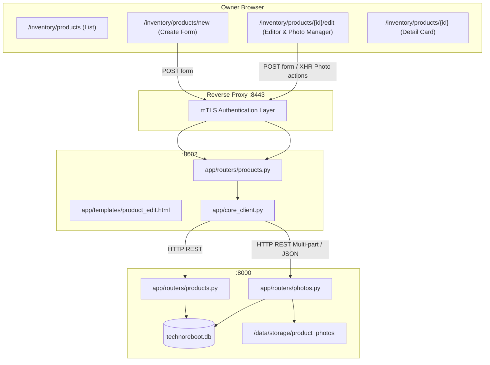

# Stage 07D-R1 — Product Create/Edit and Photo Manager

## 1. Overview & Objectives

Stage 07D-R1 introduces comprehensive manual product lifecycle management in Technoreboot web UI:
1. **Manual Product Creation**: Dedicated form at `/inventory/products/new` accessible via a prominent `+ Создать товар вручную` button on the product list.
2. **Full Product Editing**: Deep editing form at `/inventory/products/{product_id}/edit` accessible via `✏️ Редактировать товар` button on the product detail view and directly from product table rows.
3. **Dynamic Category Characteristics**: Dynamic category-aware form fields with built-in schema for standard categories (*Ноутбуки*, *Системные блоки*, *Принтеры и МФУ*, *Мониторы*, *Комплектующие*, *Оргтехника*) along with an extensible table for custom/extra characteristics, ensuring zero data loss on updates or category changes.
4. **Interactive Photo Manager**: Multi-photo upload (JPEG, PNG, WebP up to 15 MB), preview gallery, delete with confirmation, interactive reordering (`↑`/`↓`), and designating main photo (`sort_order = 0`), backed by canonical persistent filesystem storage in `/data/storage/product_photos`.
5. **Zero CLI Workflow**: All operations performed directly in the browser by the Owner over mTLS without executing terminal commands.

---

## 2. Architecture & Data Flow

---

## 3. Core API Endpoints

| Method | Endpoint | Description |
|---|---|---|
| `GET` | `/api/products/editor-meta` | Returns category metadata, predefined standard characteristics per category, supported conditions, statuses, and locations. |
| `POST` | `/api/products/` | Creates product with auto-generated canonical SKU (`PRD-XXXXXXXX`), validation, and characteristics persistence. |
| `PUT` | `/api/products/{id}` | Full update of product core fields, category, and characteristics with stock movement tracking on quantity change. |
| `GET` | `/api/products/{id}/details` | Extended product details merging relational and JSON-stored characteristics without dropping custom fields. |
| `POST` | `/api/products/{id}/photos/batch` | Multi-file upload for photos, validates file format (JPEG, PNG, WebP), max size (15 MB), generates SHA-256 unique filenames, writes to `/data/storage/product_photos/{id}/`. |
| `POST` | `/api/products/{id}/photos/reorder` | Updates sequential `sort_order` for product photos. |
| `POST` | `/api/products/{id}/photos/{photo_id}/make-main` | Designates selected photo as primary (`sort_order = 0`) and shifts others. |
| `DELETE` | `/api/products/{id}/photos/{photo_id}` | Deletes database record and physical image file from storage, reassigns main photo if deleted photo was primary. |

---

## 4. Frontend Routes & UI Components

### Web Routes (Inventory & Sales Module)
- `GET /inventory/products/new`: Renders product creation page.
- `POST /inventory/products/new`: Processes product creation form data, redirects to `/inventory/products/{id}/edit` on success.
- `GET /inventory/products/{id}/edit`: Renders product editor with pre-populated fields, dynamic characteristics, and photo manager.
- `POST /inventory/products/{id}/edit`: Processes product update form data, redirects with flash notification.
- `POST /inventory/products/{id}/photos/upload`: Uploads batch of images via multipart form or fetch API.
- `POST /inventory/products/{id}/photos/{photo_id}/make-main`: Designates photo as main photo.
- `POST /inventory/products/{id}/photos/reorder`: Reorders photos.
- `POST /inventory/products/{id}/photos/{photo_id}/delete`: Deletes a photo.

### Admin Shell Shortcut Redirects
- `GET /products/new` -> 302 Redirect to `/inventory/products/new`
- `GET /products/{id}/edit` -> 302 Redirect to `/inventory/products/{id}/edit`

---

## 5. Dynamic Category Characteristics

The editor includes predefined schemas for core hardware categories:
- **Ноутбуки**: Процессор, Оперативная память, Накопитель, Видеокарта, Диагональ экрана, Разрешение экрана, Износ аккумулятора, Цвет.
- **Системные блоки**: Процессор, Оперативная память, Накопитель, Видеокарта, Материнская плата, Блок питания, Корпус.
- **Принтеры и МФУ**: Тип печати, Цветность печати, Формат бумаги, Интерфейсы подключения, Двусторонняя печать, Ресурс картриджа.
- **Мониторы**: Диагональ, Разрешение, Тип матрицы, Частота обновления, Видеоразъемы, Соотношение сторон.
- **Комплектующие**: Тип комплектующего, Совместимость / Сокет, Форм-фактор, Интерфейс.
- **Оргтехника**: Тип устройства, Назначение, Интерфейсы подключения.

### Characteristics Preservation Policy
- When category is switched in the editor, existing entered characteristics for the previous category are moved to the **Дополнительные характеристики** section rather than deleted.
- Custom characteristics can be added or removed dynamically via `+ Добавить характеристику` button.
- When saving, standard characteristics for the active category and custom characteristics are merged into `avito_params_json` and relational attribute values.
- Unknown/extra fields received from JSON import or Avito parsing remain intact across updates.

---

## 6. Photo Manager Mechanics

1. **Upload**:
   - Supports selecting multiple files simultaneously.
   - Accepts `.jpg`, `.jpeg`, `.png`, `.webp` up to 15 MB per file.
   - Stores files in canonical `/data/storage/product_photos/{product_id}/{product_id}_{hash[:8]}.{ext}`.
2. **Preview & Sorting**:
   - Renders a responsive gallery card for each photo showing index badge, thumbnail, and actions.
   - Main photo (`sort_order = 0`) displays a prominent `⭐ Главное` badge and is disabled from "Сделать главным".
   - `↑` and `↓` buttons trigger instant reordering via AJAX or form POST.
3. **Deletion**:
   - Features confirmation prompt (`Вы уверены, что хотите удалить эту фотографию?`).
   - Removes row from `product_photos` table and deletes physical file from filesystem.
   - If the main photo is deleted, the next photo in sort order automatically becomes the new main photo (`sort_order = 0`).

---

## 7. Security & Gateway Access Control

- **mTLS Enforcement**: The NGINX reverse gateway on port 8443 strictly requires client certificates. Unauthenticated requests receive HTTP 403 Forbidden.
- **Role Permissions**: OWNER certificate has unrestricted access to create, edit, upload, reorder, and delete photos.
- **Data Integrity**: Inventory module never connects directly to SQLite database; all mutations and queries are mediated via Core REST API with strict input validation.
