# ТЕХНОРЕБУТ
## Руководство пользователя системы управления магазином и сервисным центром

**Версия руководства:** 1.0 (LOCAL)  
**Дата:** 14 сентября 2026 г.  
**Версия системы (Git commit):** `57d8bd2`  
**Версия расширения Avito:** `0.2.62`  
**Адрес локальной системы:** `https://localhost:8443`

---

<a id="toc"></a>
## СОДЕРЖАНИЕ

1. [Что такое ТехноРебут](#ch1)
2. [Быстрый старт](#ch2)
3. [Навигация по системе и роли пользователей](#ch3)
4. [Товары и складской учёт](#ch4)
5. [Добавление и редактирование товара вручную](#ch5)
6. [Штрихкоды и печать ценников 58×40](#ch6)
7. [Расширение для браузера «Техноребут Avito»](#ch7)
8. [Импорт товаров с Avito в ТехноРебут](#ch8)
9. [Оформление продаж и корзина](#ch9)
10. [Товарный чек](#ch10)
11. [Отмена продажи и возврат товаров в остатки](#ch11)
12. [Снятие объявления с Avito после продажи (ручной режим)](#ch12)
13. [Модуль ремонтов: приём, диагностика и выдача](#ch13)
14. [Отчёты по продажам и выручке](#ch14)
15. [Функции владельца (резервные копии, сертификаты, операции)](#ch15)
16. [Частые вопросы, ошибки и их решение](#ch16)
17. [Краткая памятка оператора на каждый день](#ch17)

---

<a id="ch1"></a>
## 1. Что такое ТехноРебут

[↑ К содержанию](#toc)

**ТехноРебут** — это простая и удобная программа для ежедневной работы компьютерного магазина и мастерской по ремонту электроники.

Программа помогает сотрудникам решать все основные рабочие задачи в одном месте:
- Вести складской учёт: знать, сколько ноутбуков, принтеров или комплектующих есть в наличии, где они лежат и по какой цене продаются.
- Быстро находить товары по названию, артикулу (SKU) или сканированию штрихкода.
- Печатать стандартные самоклеящиеся ценники размером 58×40 мм.
- Переносить ваши товары из объявлений на Avito в программу буквально за 1–2 клика без ручной перепечатки текста и повторной загрузки фото.
- Оформлять розничные продажи с формированием официального товарного чека для покупателя.
- Автоматически возвращать проданный товар на склад, если покупатель вернул покупку или продажа была отменена.
- Напоминать о необходимости снять проданную вещь с публикации на Avito, чтобы избежать звонков по уже проданным позициям.
- Принимать технику в ремонт, печатать наряд-заказ клиенту, вести согласование стоимости и отслеживать этапы ремонта до выдачи.

Вся работа происходит прямо в вашем обычном веб-браузере (Google Chrome, Яндекс Браузер и т. д.).

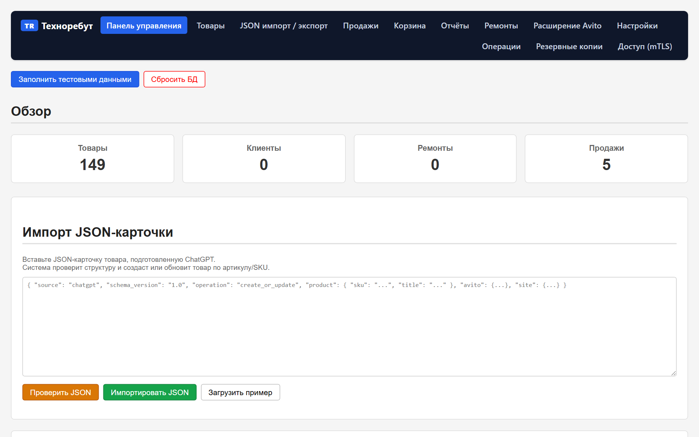
*Рисунок 1. Главная панель управления (сводка склада, продаж и ремонтов)*

---

<a id="ch2"></a>
## 2. Быстрый старт

[↑ К содержанию](#toc)

Если вы только что пришли на рабочее место, выполните эти 4 простых шага, чтобы начать работу:

1. **Откройте браузер** на вашем компьютере.
2. В адресной строке введите адрес программы: `https://localhost:8443` и нажмите клавишу Enter.
3. Если браузер запросит выбор сертификата безопасности — подтвердите ваш рабочий сертификат (например, `owner` или сертификат сотрудника).
4. Перед вами откроется главная страница **«Панель управления»** (Рисунок 1). Вы готовы к работе!

> 💡 **Совет:** Добавьте адрес `https://localhost:8443` в закладки браузера или на панель избранного, чтобы открывать программу в один клик.

---

<a id="ch3"></a>
## 3. Навигация по системе и роли пользователей

[↑ К содержанию](#toc)

### 3.1. Верхняя панель навигации
В самом верху каждого экрана расположена темная полоса меню. С её помощью можно в любой момент перейти в любой нужный раздел программы:

- **TR Техноребут** / **Панель управления** — возврат на главную сводную страницу.
- **Товары** — каталог товаров магазина, фильтры по наличию, поиск и карточки товаров.
- **JSON импорт / экспорт** — выгрузка каталога и загрузка готовых списков.
- **Продажи** — журнал всех оформленных розничных продаж, просмотр чеков, отмена продаж.
- **Корзина** — оформление покупки из нескольких товаров одновременно.
- **Отчёты** — просмотр выручки за сегодня, неделю, месяц или произвольный период с разбивкой по наличным, картам и СБП.
- **Ремонты** — журнал заказов сервисного центра, приём новых устройств, ведение диагностики.
- **Расширение Avito** — скачивание плагина для Chrome и код подключения расширения.
- **Настройки** — реквизиты вашей организации для товарных чеков (название, ИНН, адрес, телефон).
- **📘 Инструкция** — скачивание этого руководства пользователя в формате PDF в один клик.
- **Резервные копии** — создание бэкапов базы данных (для владельца).
- **Доступ (mTLS)** — управление клиентскими сертификатами доступа (для владельца).
- **Операции** — техническая синхронизация и обновление (для владельца).

### 3.2. Разница между правами СОТРУДНИКА (USER) и ВЛАДЕЛЬЦА (OWNER)
- **Сотрудник магазина / мастер (USER):** работает с товарами, ценами, ценниками, продажами, чеками, ремонтами, отчётами и расширением Avito.
- **Владелец (OWNER):** дополнительно имеет доступ к управлению сертификатами доступа, созданию и скачиванию резервных копий (бэкапов) и техническим операциям синхронизации с сервером VDS.

---

<a id="ch4"></a>
## 4. Товары и складской учёт

[↑ К содержанию](#toc)

### Что делает эта функция
Раздел «Товары» — это главный каталог всего ассортимента, хранящегося на складе, в торговом зале или мастерской. Здесь отображается количество каждого наименования, цена продажи, статус и фотографии.

### Где её найти
Нажмите кнопку **«Товары»** в верхнем меню (адрес `/inventory/products`).

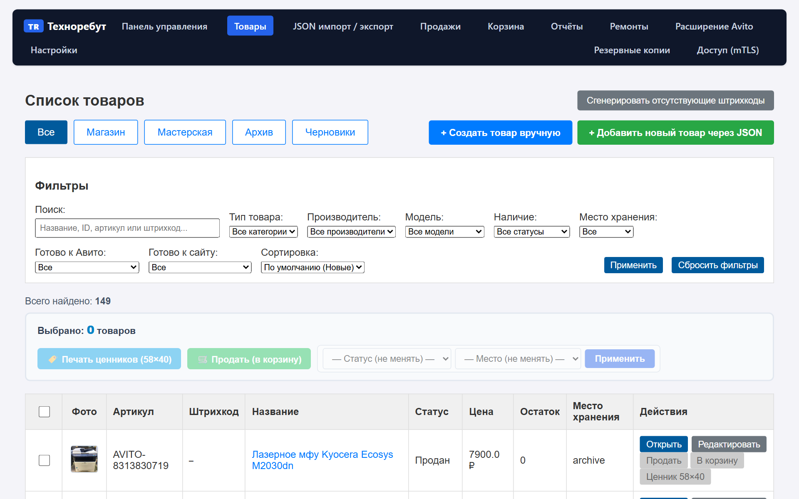
*Рисунок 2. Каталог товаров с поиском и фильтрами*

### Основные элементы экрана
- **Поисковая строка:** введите часть названия, модель или штрихкод и нажмите «Найти».
- **Фильтр по статусу:**
  - *Все статусы* — полный список товаров.
  - *В наличии (in_stock)* — товары, которые можно продать прямо сейчас.
  - *Черновик (draft)* — товары в процессе оформления описания.
  - *В резерве (reserved)* — товары, отложенные под клиента.
  - *В ремонте (in_repair)* — товары на диагностике или восстановлении.
  - *Продан (sold)* — архив проданных позиций.
  - *Списан (written_off)* — непригодные к продаже позиции.
- **Фильтр по месту хранения (Локация):**
  - *Магазин (store)* — на витрине или складе магазина.
  - *Мастерская (workshop)* — в зоне сервиса.
  - *Архив (archive)* — архивное хранение.
- **Кнопка «+ Добавить товар»:** открывает форму ручного ввода нового товара.

---

<a id="ch5"></a>
## 5. Добавление и редактирование товара вручную

[↑ К содержанию](#toc)

### Что делает эта функция
Позволяет создать в базе данных новую позицию товара с указанием названия, цены продажи, количества, состояния, характеристик и фотографий.

### Где её найти
В разделе **«Товары»** нажмите синюю кнопку **«+ Добавить товар»** (адрес `/inventory/products/new`).

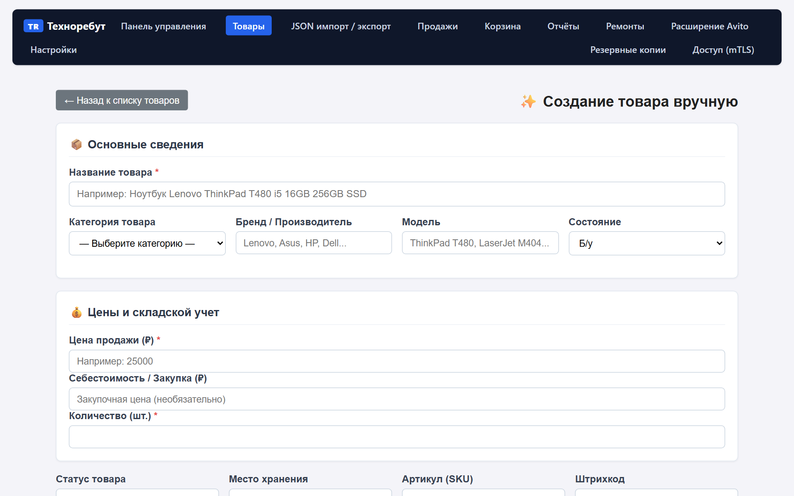
*Рисунок 3. Форма добавления нового товара*

### Что нужно заполнять (поля формы)

| Поле | Что писать | Обязательно? | Пример |
| :--- | :--- | :---: | :--- |
| **Название товара** | Понятное для покупателя наименование устройства | **Да** | *Ноутбук Lenovo ThinkPad T480 i5 16GB 256GB SSD* |
| **Категория товара** | Выберите из списка или укажите свою | Нет | *Ноутбуки*, *Принтеры*, *Мониторы* |
| **Бренд** | Производитель устройства | Нет | *Lenovo*, *HP*, *Asus* |
| **Модель** | Точная модель | Нет | *ThinkPad T480*, *LaserJet M404* |
| **Состояние** | Физическое состояние устройства | Нет | *Б/У*, *Новый*, *На запчасти* |
| **Цена продажи (₽)** | Розничная цена для клиента | **Да** | *25000* |
| **Себестоимость / Закупка (₽)** | Цена, за которую товар был приобретен | Нет | *18000* (покупатель эту цену не видит) |
| **Количество (шт.)** | Сколько штук поступило на склад | **Да** | *1* (по умолчанию 1) |
| **Статус товара** | Текущее состояние позиции | **Да** | *В наличии (in_stock)* |
| **Место хранения** | Где физически лежит товар | **Да** | *Магазин (store)* |
| **Артикул (SKU)** | Внутренний код учета | Нет | Оставьте пустым — система создаст его сама |
| **Штрихкод** | Цифры штрихкода с коробки | Нет | Оставьте пустым для автогенерации |
| **Описание товара** | Подробное описание, комплектация, дефекты | Нет | *Батарея держит 4 часа. В комплекте оригинальная зарядка.* |

### Пошаговые действия
1. Введите понятное название товара.
2. Укажите цену продажи и количество.
3. При необходимости укажите категорию, бренд и добавьте описание.
4. Нажмите синюю кнопку **«💾 Создать товар»** внизу формы.
5. После сохранения откроется карточка созданного товара.
6. В блоке **«📸 Фотографии товара»** нажмите кнопку **«📁 Выбрать фотографии на диске»** и выберите фото товара. Фотографии сразу загрузятся в галерею.
7. Вы можете назначить главное фото кнопкой **«★ Сделать главным»** или поменять их порядок стрелками.

### Как понять, что всё получилось
Появится зеленое сообщение: `✓ Товар успешно сохранен`, а в каталоге товаров появится новая строка с вашим товаром и фото.

---

<a id="ch6"></a>
## 6. Работа со штрихкодами и ценниками

[↑ К содержанию](#toc)

### Что делает эта функция
Позволяет быстро идентифицировать товар при продаже сканером штрихкодов, а также распечатать стандартный ценник-наклейку размером 58×40 мм для наклеивания на корпус или коробку устройства.

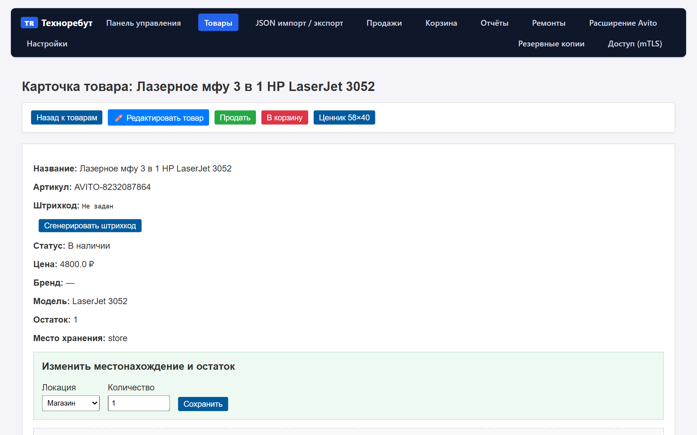
*Рисунок 4. Карточка товара: просмотр фото, штрихкод и кнопка печати ценника*

### Пошагово: генерация штрихкода
1. Откройте карточку товара.
2. В строке **Штрихкод** посмотрите, есть ли код.
3. Если штрихкод не был задан, нажмите кнопку **«Сгенерировать штрихкод»**.
4. Система создаст уникальный 13-значный штрихкод формата EAN-13, начинающийся с префикса `200...`.

### Пошагово: печать ценника 58×40 мм
1. В верхней панели карточки товара нажмите синюю кнопку **«Ценник 58×40»**.
2. В новой вкладке откроется готовый макет ценника, содержащий:
   - Крупное название магазина (Техноребут);
   - Название товара и модель;
   - Цену продажи крупным жирным шрифтом в рублях;
   - Читаемый графический штрихкод со сканируемыми полосами;
   - Артикул и дату формирования.
3. Нажмите комбинацию клавиш `Ctrl + P` (или кнопку «Печать» в браузере).
4. Выберите термопринтер этикеток (например, Xprinter, Атол) с размером ленты 58×40 мм и нажмите «Печать».

---

<a id="ch7"></a>
## 7. Расширение для браузера «Техноребут Avito»

[↑ К содержанию](#toc)

### Что делает эта функция
Специальный плагин для браузера Google Chrome позволяет связать ваш рабочий браузер с базой ТехноРебут. С его помощью можно передавать объявления с Avito прямо в базу магазина без ручного ввода.

> 🔒 **Безопасность:** Расширение не требует ввода пароля от Avito, не сохраняет личные данные и работает строго локально между вашим браузером и программой ТехноРебут.

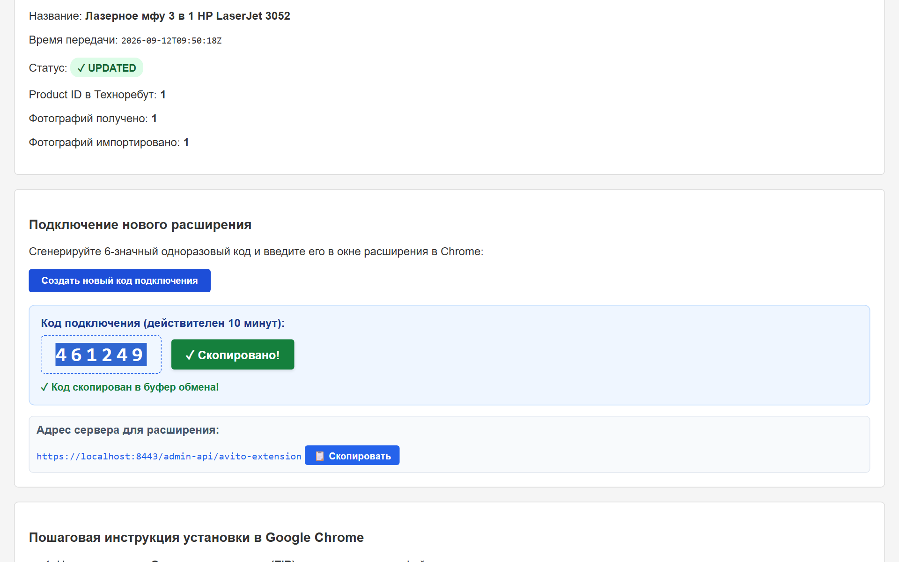
*Рисунок 5. Страница настройки расширения и генерации кода сопряжения*

### Как установить расширение в Google Chrome (пошагово)
1. В меню ТехноРебут перейдите в раздел **«Расширение Avito»** (`/avito/extension`).
2. Нажмите большую синюю кнопку **«Скачать расширение (ZIP, v0.2.62)»** и сохраните файл на рабочий стол.
3. Распакуйте скачанный ZIP-архив (нажмите правой кнопкой мыши ➔ «Извлечь всё...»).
4. В браузере Google Chrome откройте страницу расширений: введите в адресной строке `chrome://extensions` и нажмите Enter.
5. В правом верхнем углу включите переключатель **«Режим разработчика»** (Developer mode).
6. В левом верхнем углу нажмите кнопку **«Загрузить распакованное расширение»**.
7. Выберите распакованную папку `technoreboot-avito`.
8. Иконка с синим логотипом ТехноРебут появится на панели расширений Chrome.

### Как подключить (связать) расширение с программой
1. На странице `/avito/extension` в ТехноРебут нажмите кнопку **«Создать новый код подключения»**.
2. На экране появится 6 крупных синих цифр (например, `123456`) и зеленая кнопка **«📋 Скопировать»**.
3. Нажмите кнопку **«📋 Скопировать»** — код скопируется в буфер обмена.
4. Нажмите на иконку расширения ТехноРебут в правом верхнем углу браузера Chrome.
5. В открывшемся окне вставьте скопированный код в поле ввода и нажмите синюю кнопку **«Подключить»** (Рисунок 6).
6. Значок в правом верхнем углу сменится на зеленый **Online / Подключено**. Сопряжение завершено!

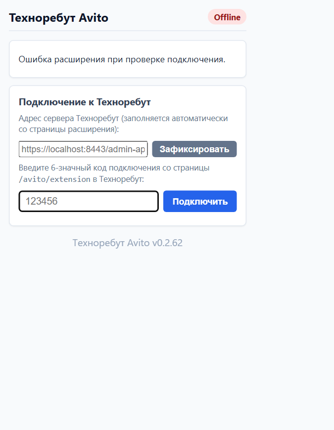
*Рисунок 6. Всплывающее окно расширения Техноребут Avito*

---

<a id="ch8"></a>
## 8. Импорт товаров с Avito в ТехноРебут

[↑ К содержанию](#toc)

### Что делает эта функция
Позволяет взять любое ваше объявление на Avito и мгновенно перенести его в каталог ТехноРебут со всеми фотографиями, названием, ценой, состоянием и текстом описания.

### Пошагово: импорт одного объявления
1. Откройте в браузере страницу нужного объявления на сайте `avito.ru`.
2. Вверху страницы (или в окне плагина) нажмите зеленую кнопку **«Передать объявление в Техноребут»**.
3. Расширение за 1–2 секунды передаст данные в систему.
4. Появится надпись: `✓ Объявление успешно передано в Техноребут!` и кнопка **«🔍 Открыть товар в Техноребут»**.
5. Нажмите на эту кнопку — вы сразу перейдете в созданную карточку товара в ТехноРебут. Товар уже готов к продаже и печати ценника!

---

<a id="ch9"></a>
## 9. Оформление продаж и корзина

[↑ К содержанию](#toc)

### Что делает эта функция
Фиксирует факт продажи товара покупателю, уменьшает остаток на складе, сохраняет способ оплаты и формирует чек.

### Способ 1: Быстрая продажа одного товара
1. В карточке товара или в списке товаров найдите нужную позицию.
2. Нажмите зеленую кнопку **«Продать»** (Рисунок 4).
3. Откроется страница оформления продажи (Рисунок 8).
4. Проверьте цену и количество.
5. Выберите **Способ оплаты**:
   - *Наличные (cash)*
   - *Банковская карта (card)*
   - *Перевод на карту (transfer)*
   - *СБП (sbp)*
   - *Счет юрлица (legal_entity_account)*
6. Укажите срок гарантии в днях (по умолчанию 30 дней) или отметьте галочку «Без гарантии».
7. Нажмите зеленую кнопку **«Подтвердить продажу»**.

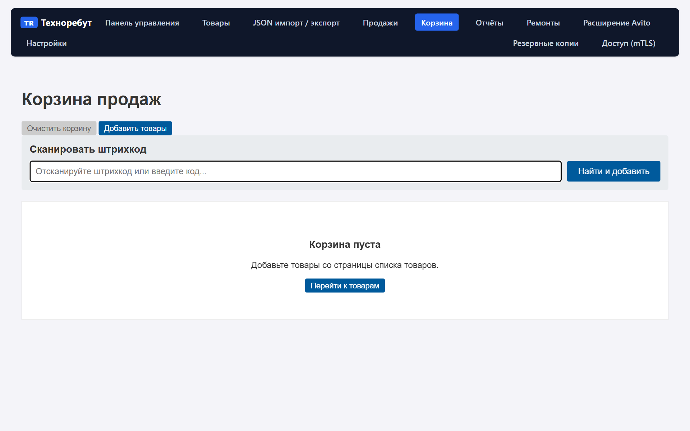
*Рисунок 7. Корзина товаров для оформления нескольких позиций одним чеком*

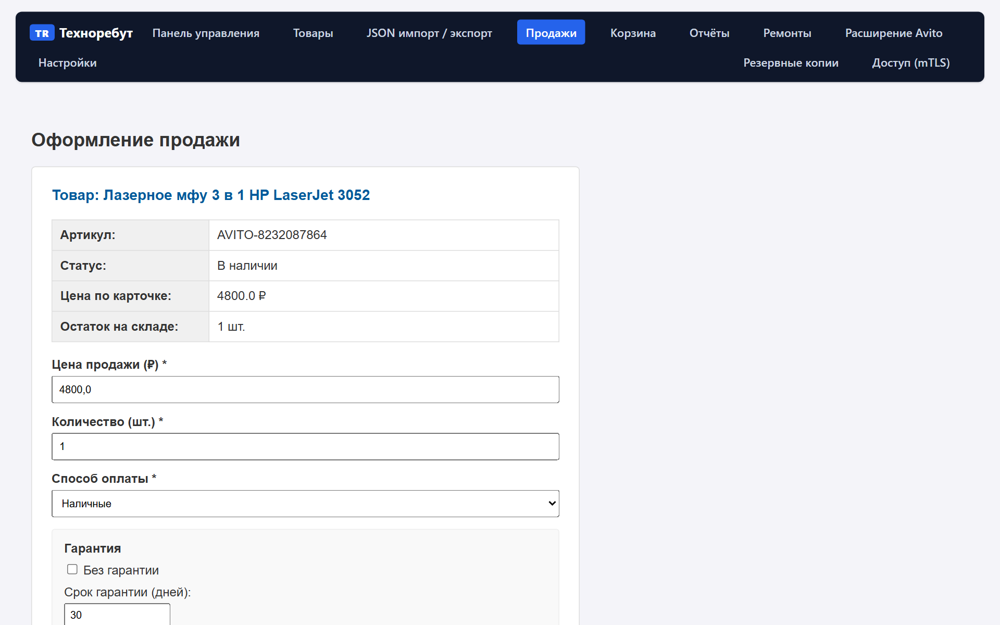
*Рисунок 8. Экран подтверждения продажи*

### Способ 2: Продажа через Корзину (несколько товаров)
1. При просмотре товаров нажимайте красную кнопку **«В корзину»**.
2. Перейдите в раздел **«Корзина»** в верхнем меню (Рисунок 7).
3. Проверьте список выбранных позиций и общую сумму.
4. Выберите способ оплаты и нажмите **«Оформить продажу из корзины»**.

### Что произойдет после сохранения продажи
- Количество проданного товара на складе автоматически уменьшится.
- Если был продан последний экземпляр, статус товара сменится на «Продан (sold)».
- Продажа появится в общем журнале продаж (Рисунок 9) и сразу попадет в отчёты выручки за текущий день.
- Откроется карточка оформленной продажи с готовым товарным чеком.

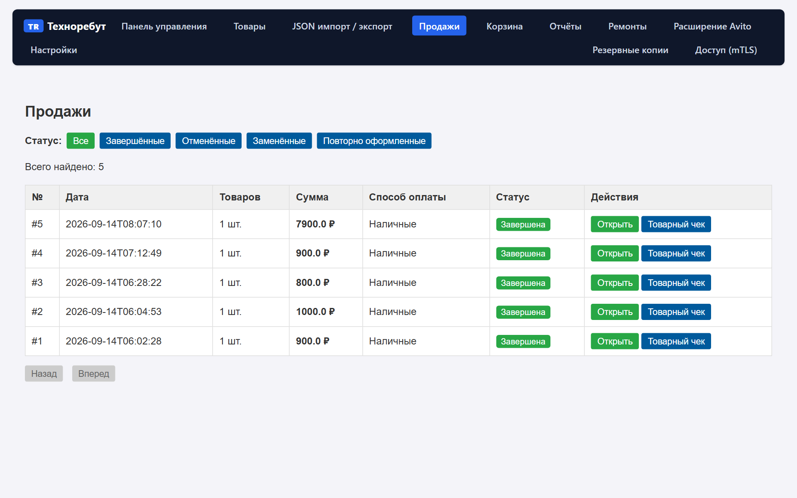
*Рисунок 9. Журнал всех завершенных розничных продаж*

---

<a id="ch10"></a>
## 10. Товарный чек

[↑ К содержанию](#toc)

### Что делает эта функция
Формирует печатный документ установленного образца для выдачи покупателю. В чеке указаны реквизиты вашего магазина, наименования товаров, количество, цены, сумма, форма оплаты и гарантийные обязательства.

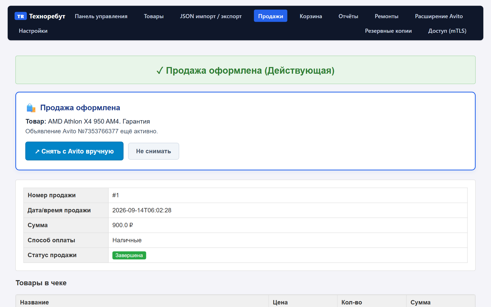
*Рисунок 10. Детали оформленной продажи, кнопка товарного чека и блок Avito*

### Пошагово: печать товарного чека
1. Откройте карточку продажи (раздел меню «Продажи» ➔ нажмите на номер нужной продажи).
2. Нажмите синюю кнопку **«Товарный чек»**.
3. На экране появится аккуратный бланк товарного чека с рамками, подписями продавца и покупателя.
4. Нажмите `Ctrl + P` на клавиатуре и распечатайте документ на обычном офисном принтере (формат А4 или А5).
5. Передайте распечатанный чек покупателю вместе с товаром.

---

<a id="ch11"></a>
## 11. Отмена продажи и возврат товаров в остатки

[↑ К содержанию](#toc)

### Что делает эта функция
Если покупатель отказался от покупки или вернул товар в магазин, система позволяет корректно отменить продажу. При этом весь проданный товар **автоматически возвращается в остатки на склад** и снова становится доступен для продажи.

### Пошагово: как отменить продажу
1. Перейдите в раздел меню **«Продажи»** и откройте нужную продажу.
2. Прокрутите страницу вниз до блока **«Отменить продажу»** (выделен красной рамкой).
3. В поле **«Причина отмены»** обязательно напишите, почему отменяется продажа (например: *«Возврат клиентом: не подошел размер»* или *«Ошибка кассира»*).
4. Укажите ваше имя в поле «Кто отменяет».
5. Нажмите красную кнопку **«Отменить продажу»** и подтвердите действие в появившемся окне.

### Что произойдет после отмены
- Статус продажи изменится на «Отменена (canceled)».
- В карточке продажи появится отметка о дате отмены и указанной причине.
- Количество товара на складе восстановится, статус снова станет «В наличии (in_stock)».
- Сумма продажи вычтется из дневной выручки в отчётах.

---

<a id="ch12"></a>
## 12. Снятие объявления с Avito после продажи (ручной режим)

[↑ К содержанию](#toc)

### Почему это важно
Если товар был ранее опубликован на Avito и вы продали его в магазине, объявление нужно закрыть, чтобы не вводить покупателей в заблуждение и не тратить время на звонки по отсутствующему товару.

### Принятый в системе безопасный ручной порядок (Manual Flow)
ТехноРебут намеренно **не пытается нажимать кнопки на сайте Avito автоматически**. Вместо этого программа делает всё максимально удобно для оператора:

1. Сразу после подтверждения продажи товара, связанного с Avito, вверху экрана появляется синяя рамка (Рисунок 10):
   > **🛍️ Продажа оформлена**  
   > Товар: HP LaserJet 3052. Объявление Avito №... ещё активно.
2. Нажмите крупную синюю кнопку **«↗ Снять с Avito вручную»**.
3. Программа в новой вкладке браузера откроет точную страницу именно этого объявления на Avito.
4. Нажмите на Avito стандартную кнопку **«Снять с публикации»** (или «Снять с продажи») и укажите причину (например, *«Продал на Avito»* или *«Товар продан»*).
5. Вернитесь на вкладку ТехноРебут и нажмите зеленую кнопку **«✓ Я снял объявление»**.
6. Статус сменится на: `✓ Объявление Avito снято с публикации (подтверждено оператором)`.
7. Если вы продали товар, но у вас есть ещё такие же позиции в наличии и снимать объявление не нужно — просто нажмите кнопку **«Не снимать»**.

---

<a id="ch13"></a>
## 13. Модуль ремонтов: приём, диагностика и выдача

[↑ К содержанию](#toc)

### Что делает эта функция
Полноценный учёт работы сервисного центра: регистрация клиентской техники, фиксация неисправности, печать наряд-заказа при приёме, ведение диагностики, согласование стоимости с клиентом и выдача готового устройства.

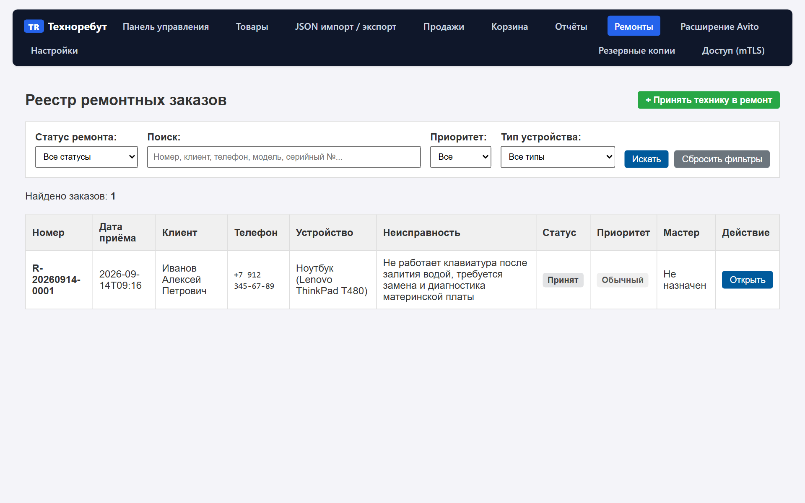
*Рисунок 11. Журнал заказов сервисного центра со статусами выполнения*

### Пошагово: приём техники в ремонт
1. Перейдите в раздел **«Ремонты»** в верхнем меню (`/repairs/repairs`).
2. Нажмите зеленую кнопку **«+ Принять в ремонт»** (`/repairs/repairs/new`).
3. Заполните данные по 4 простым блокам (Рисунок 12):

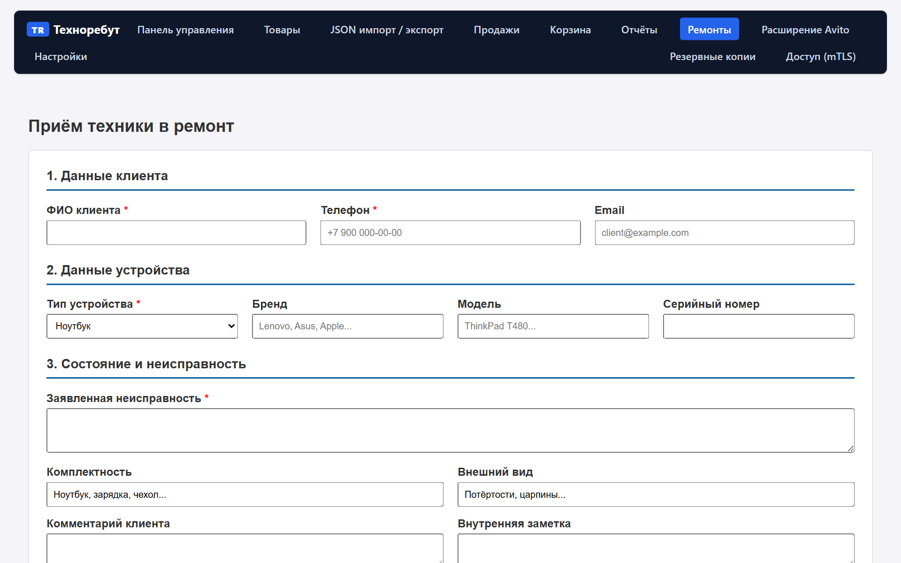
*Рисунок 12. Форма приёма устройства в ремонт*

| Блок | Поле | Обязательно? | Что писать |
| :--- | :--- | :---: | :--- |
| **1. Клиент** | ФИО клиента | **Да** | Фамилия Имя Отчество заказчика |
| | Телефон | **Да** | Номер для связи в формате +7 900 000-00-00 |
| | Email | Нет | Электронная почта для уведомлений |
| **2. Устройство** | Тип устройства | **Да** | Ноутбук, Смартфон, Принтер, Системный блок... |
| | Бренд / Модель | Нет | Например: *Lenovo ThinkPad T480* |
| | Серийный номер | Нет | Серийный номер (S/N) с наклейки на корпусе |
| **3. Состояние** | Заявленная неисправность | **Да** | Что не работает со слов клиента (например: *Не включается после залития*) |
| | Комплектность | Нет | Например: *Ноутбук + блок питания + сумка* |
| | Внешний вид | Нет | Царапины, сколы, трещины экрана |
| **4. Сервис** | Стоимость диагностики | **Да** | Базовая цена диагностики (по умолчанию 500 ₽) |
| | Ответственный мастер | Нет | Имя специалиста, проводящего ремонт |

4. Нажмите кнопку **«Принять в ремонт»**.
5. Заказу присвоится номер (например, `REP-2026-00001`).
6. Нажмите кнопку **«🖨️ Печать наряд-заказа»** и выдайте один экземпляр клиенту с его и вашей подписью.

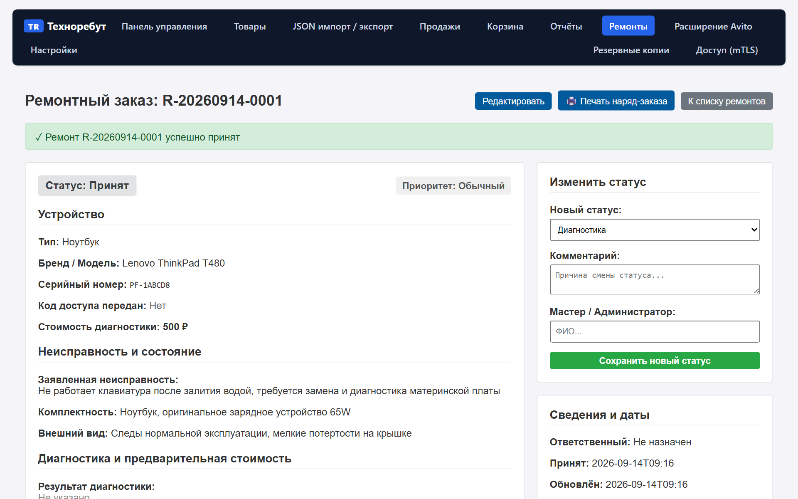
*Рисунок 13. Карточка ремонтного заказа и смена статусов работы*

### Этапы (жизненный цикл) ремонта
В правой колонке карточки ремонта вы можете переключать статус по мере выполнения работ:
1. **Принят (intake):** устройство на складе приёмки, ждёт мастера.
2. **На диагностике (diagnostics):** мастер проводит разборку и поиск дефекта.
3. **На согласовании (agreement):** мастер выявил поломку, оператор звонит клиенту для согласования цены.
4. **В работе (in_progress):** клиент дал согласие, мастер устанавливает детали и тестирует.
5. **Готов к выдаче (ready):** ремонт завершен, клиенту отправлено уведомление о готовности.
6. **Выдан (issued):** клиент оплатил работу и забрал технику.
7. **Отказ / Отменен (canceled / rejected):** ремонт признан нецелесообразным или клиент отказался от цены.

---

<a id="ch14"></a>
## 14. Отчёты по продажам и выручке

[↑ К содержанию](#toc)

### Что делает эта функция
Показывает реальную картину продаж магазина за выбранный отрезок времени: сколько денег поступило наличными, сколько через терминал (карты), сколько по СБП и какова общая сумма.

### Где её найти
Нажмите кнопку **«Отчёты»** в верхнем меню (адрес `/inventory/reports/sales`).

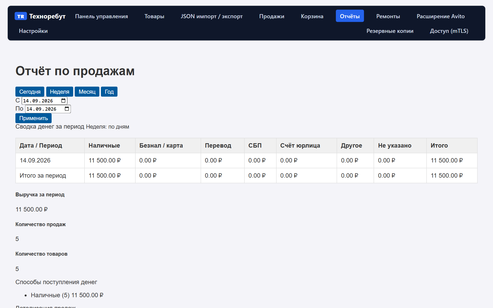
*Рисунок 14. Сводный отчёт по продажам с разбивкой по формам оплаты*

### Как пользоваться отчётом
- **Быстрые кнопки периода:**
  - *Сегодня* — выручка за текущий рабочий день (смена).
  - *Неделя* — данные за текущую неделю по дням.
  - *Месяц* — данные за текущий календарный месяц.
  - *Год* — помесячная динамика за весь год.
- **Произвольный диапазон:** укажите даты «С» и «По» и нажмите кнопку «Применить».
- **Таблица «Сводка денег за период»:** показывает чистую выручку по каждой строке без учета отмененных продаж.

---

<a id="ch15"></a>
## 15. Функции владельца (резервные копии, сертификаты, операции)

[↑ К содержанию](#toc)

> ⚠️ **Внимание:** Этот раздел предназначен для владельца системы (OWNER). Обычным продавцам и мастерам эти настройки не требуются для ежедневных продаж и приёма техники.

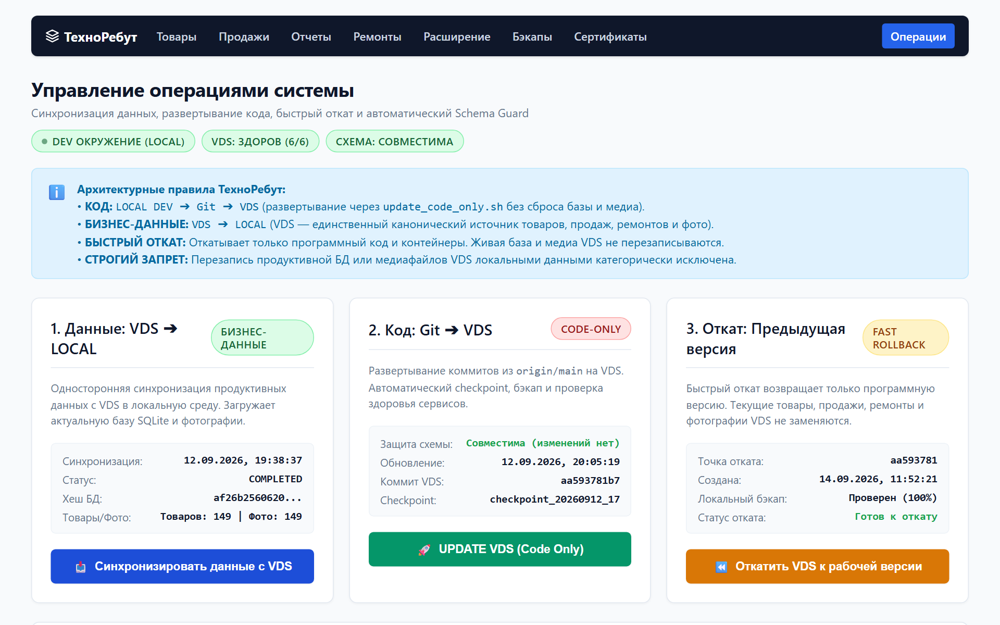
*Рисунок 15. Панель операций владельца*

### 15.1. Резервные копии (Бэкапы) — раздел `/backups`
- **Что делает:** сохраняет полный снимок базы данных со всеми товарами, ценами, клиентами и продажами в архивный файл.
- **Как создать бэкап:** нажмите кнопку «Создать резервную копию сейчас».
- **Как сохранить на флешку:** в списке бэкапов нажмите «Скачать» напротив последней копии.
- **Рекомендация:** скачивайте резервную копию на отдельную флешку или внешний диск не реже одного раза в неделю.

### 15.2. Управление доступом (mTLS) — раздел `/certificates`
- **Что делает:** управляет цифровыми ключами доступа сотрудников. Без установленного сертификата доступ к системе с чужих устройств невозможен.
- **Создание доступа для нового сотрудника:** нажмите «Выпустить сертификат», укажите имя сотрудника (роль USER). Скачайте полученный файл `.p12` и установите его в браузер сотрудника.

### 15.3. Панель операций — раздел `/system/operations`
- **Данные: VDS ➔ LOCAL:** односторонняя загрузка актуальной базы товаров и фотографий с боевого сервера на ваш рабочий компьютер.
- **Код: Git ➔ VDS:** обновление версии программного обеспечения на сервере без перезаписи базы данных.
- **Быстрый откат (Rollback):** возврат к предыдущему программному состоянию при возникновении неполадок.

---

<a id="ch16"></a>
## 16. Частые вопросы, ошибки и их решение

[↑ К содержанию](#toc)

### 1. Расширение Avito показывает статус «Offline»
- **Причина:** адрес сервера не зафиксирован или код сопряжения устарел (он действует 10 минут).
- **Решение:** зайдите в меню ТехноРебут ➔ *Расширение Avito*, нажмите кнопку *«Создать новый код подключения»*, нажмите *«📋 Скопировать»*. Откройте расширение в браузере, вставьте код и нажмите *«Подключить»*.

### 2. Кнопка «Продать» на карточке товара серая и не нажимается
- **Причина:** товар имеет нулевой остаток (`Остаток: 0`), находится в статусе «Продан», «Черновик» или лежит в локации «Мастерская».
- **Решение:** в карточке товара проверьте блок «Изменить местонахождение и остаток». Установите локацию «Магазин (store)», количество не менее 1 и сохраните. Кнопка «Продать» станет активной.

### 3. Товар вернули в магазин, как вернуть деньги в кассу?
- **Решение:** откройте раздел «Продажи», найдите продажу, внизу страницы напишите причину и нажмите красную кнопку «Отменить продажу». Товар вернется на витрину, а выручка пересчитается.

### 4. Не печатается ценник или съезжает разметка
- **Решение:** в окне печати браузера (`Ctrl + P`) убедитесь, что в поле «Размер бумаги» выбран формат **58×40 мм** (или «По размеру страницы»), а поля (margins) установлены в значение «Минимум» или «Нет».

---

<a id="ch17"></a>
## 17. Краткая памятка оператора на каждый день

[↑ К содержанию](#toc)

```text
========================================================================
                      ПАМЯТКА СОТРУДНИКА ТЕХНОРЕБУТ
========================================================================

УТРО (НАЧАЛО ДНЯ):
1. Откройте браузер -> перейдите на https://localhost:8443
2. Проверьте зеленый значок расширения Avito в браузере (должен быть Online).
3. Проверьте раздел «Товары» — наличие актуально.

ПРИЁМ ТОВАРА НА СКЛАД:
- С Avito: откройте страницу объявления на Avito -> нажмите «Передать объявление в Техноребут».
- Вручную: меню «Товары» -> «+ Добавить товар» -> заполните название, цену продажи, фото -> Сохранить.
- Печать ценника: в карточке товара нажмите «Ценник 58×40» -> Ctrl+P.

ПРОДАЖА ТОВАРА:
1. В карточке товара нажмите «Продать» (или наберите корзину).
2. Выберите способ оплаты (наличные, карта, СБП).
3. Нажмите «Подтвердить продажу».
4. Распечатайте «Товарный чек» и отдайте покупателю.
5. Если товар стоял на Avito: нажмите «Снять с Avito вручную» -> закройте объявление на Avito -> нажмите «Я снял объявление».

ПРИЁМ ТЕХНИКИ В РЕМОНТ:
1. Меню «Ремонты» -> «+ Принять в ремонт».
2. Запишите ФИО, телефон, модель и неисправность.
3. Распечатайте наряд-заказ клиенту.

КОНЕЦ СМЕНЫ:
1. Меню «Отчёты» -> нажмите «Сегодня».
2. Сверьте сумму наличных и безналичных оплат в кассе со сводкой отчёта.
========================================================================
```
