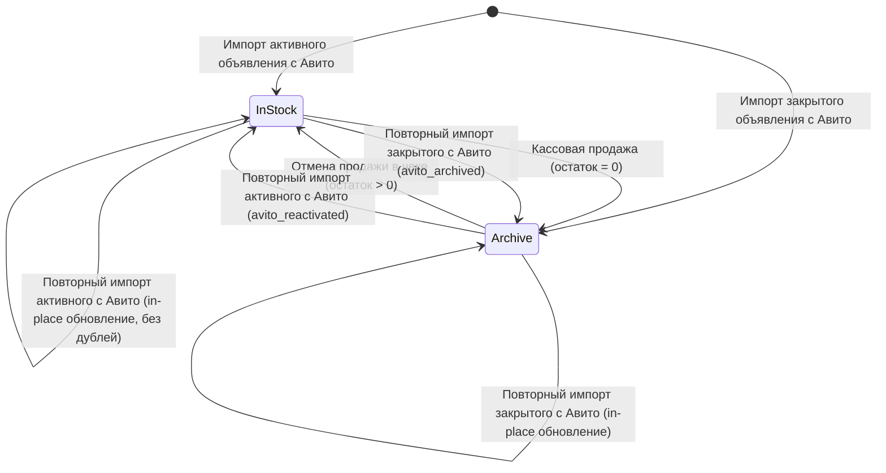

# Комплексный архитектурный отчет: Массовые операции, автоматическая архивация и двусторонняя синхронизация с Авито

## 1. Введение и контекст

Настоящий отчет подготовлен для архитектора проекта и владельца системы **Technoreboot**. В нем обобщены архитектурные решения, изменения в структуре базы данных, API-контрактах и пользовательских интерфейсах, реализованные за последние этапы (коммиты с `2e50ccb` по `1da7f4b`).

Отчет охватывает 5 взаимосвязанных этапов:
1. **Массовые (пакетные) операции над товарами** (выбор, смени статусов, складов, печать ценников 58×40, добавление в чек).
2. **Унификация пакетного управления статусом и местом хранения** (единая кнопка «Применить» и одновременное обновление).
3. **Статусы по умолчанию при импорте с Авито и авто-архивация при продаже** («В наличии / Магазин» при импорте, «Архив / Продан» при продаже через кассу, возврат при отмене чека).
4. **Двусторонняя синхронизация архива с Авито** (разархивация при повторном выставлении на Авито, авто-архивация при закрытии на Авито).
5. **Верификация и защита Avito ID как сквозного первичного идентификатора** (поиск по всей БД без фильтров статуса, fallback по SKU, нулевое дублирование товаров).

---

## 2. Архитектура и компонентная схема

В реализации задействованы три сервисных слоя:
1. **Core API (`technoreboot-core`, FastAPI + SQLite + SQLAlchemy):**
   - Управляет состоянием товарного каталога (`products`, `product_photos`, `product_events`, `product_external_listings`).
   - Обеспечивает транзакционность пакетных изменений (`POST /api/products/batch`).
   - Реализует логику идемпотентного upsert и двусторонней синхронизации Авито (`POST /api/integrations/avito/import-item`).
   - Управляет жизненным циклом кассовых продаж (`POST /api/sales/`, `/cancel`, `/reissue`) с автоматическим переводом остатков в архив.
2. **Модуль склада и продаж (`technoreboot-inventory-sales-module`, FastAPI + Jinja2 + Vanilla JS):**
   - Предоставляет веб-интерфейс каталога (`/inventory/products`).
   - Реализует плавающую панель массовых действий (`#batch-actions-bar`) с выбором строк через чекбоксы и горячими клавишами (Shift-клик).
   - Генерирует печатные формы ценников 58×40 мм (`/products/price-tags/batch`).
   - Передает выбранные позиции в корзину продаж (`/inventory/cart/`).
3. **Защищенный шлюз (`technoreboot-gateway`, Nginx Alpine, mTLS на порту 8443):**
   - Обеспечивает единый доверенный вход для владельца по клиентскому сертификату x509 (`owner.crt` / `owner.p12`).

---

## 3. Детализация реализованных этапов

### Этап 1: Массовые операции над товарами (Коммит `2e50ccb`)
- **Проблема:** Владельцу приходилось редактировать каждый товар индивидуально, открывая отдельную карточку, что делало управление партиями товаров трудоемким.
- **Решение:**
  - **Core API:** Добавлен контракт `POST /api/products/batch`:
    ```json
    {
      "product_ids": [101, 102, 103],
      "status": "in_stock",
      "storage_location": "store"
    }
    ```
    Все изменения выполняются в единой транзакции БД с фиксацией в `audit_log` и `product_events`.
  - **Интерфейс каталога (`products.html`):**
    - Мастер-чекбокс в заголовке таблицы (`#select-all-products`) с поддержкой выбора всех товаров на странице.
    - Индивидуальные чекбоксы у каждой строки с поддержкой диапазонного выделения (Shift + Click).
    - Динамическая плавающая панель (`#batch-actions-bar`), появляющаяся при выборе >= 1 товара, с бейджем количества (`#selected-count`).
  - **Печать ценников 58×40 мм (`price_tag_batch.html`):**
    - Генерация термоэтикеток стандарта 58×40 мм с штрихкодом Code128 (SVG), названием, ценой и датой.
    - CSS-директивы `@page { size: 58mm 40mm; margin: 0; }` и разрывы страниц `page-break-after: always;` для непрерывной рулонной печати без диалогов настройки полей.
  - **Массовое добавление в корзину:**
    - Выбранные товары передаются в кассовую сессию для одновременного оформления в едином чеке.

### Этап 2: Унификация пакетного управления статусом и местом хранения (Коммит `53ac611`)
- **Проблема:** Изначально в панели действий находились две отдельные кнопки «Применить» (отдельно для статуса и для склада), что требовало двух последовательных кликов при перемещении товара.
- **Решение:**
  - Элементы выбора объединены в единую форму с одной кнопкой «Применить» (`#btn-batch-apply-changes`).
  - Добавлены недеструктивные плейсхолдеры: `— Статус (не менять) —` и `— Место (не менять) —`.
  - Валидация на клиенте: предупреждение, если пользователь нажал «Применить», не выбрав ни одного параметра.
  - Маршрут `POST /products/batch-action` принимает `action="apply_changes"` и отправляет в Core API одновременно обновленные поля `status` и `storage_location` в едином сетевом вызове.

### Этап 3: Дефолты импорта с Авито и авто-архивация при продаже (Коммит `d8234d8`)
- **Проблема:** Ранее товары с Авито импортировались в статусе `draft` («Черновик»), требуя ручной активации. При продаже товар списывался по остатку, но оставался висеть в основном списке магазина со статусом `in_stock`.
- **Решение:**
  - **Дефолты импорта (`core/app/routers/integrations.py`):**
    - Новый товар сразу получает `status = "in_stock"` («В наличии»), `storage_location = "store"` («Магазин») и `quantity = 1`.
    - Товар мгновенно отображается на витрине магазина и доступен для добавления в чек.
  - **Автоматический перенос в архив при продаже (`core/app/routers/sales.py`):**
    - При оформлении чека (`create_sale`) или перевыпуске (`reissue_sale`), если остаток товара достигает `0`:
      - `status` устанавливается в `"sold"` («Продан»).
      - `storage_location` устанавливается в `"archive"` («Архив»).
      - В `product_events` записывается факт перемещения на склад «Архив».
  - **Возврат при отмене продажи (`cancel_sale`):**
    - При аннулировании чека товар возвращается из архива: `status = "in_stock"`, `storage_location = "store"`, остаток восстанавливается.
  - **Миграция существующих данных:**
    - Все 46 ранее импортированных черновиков в базе данных были штатно переведены в статус `in_stock` / `store`.

### Этап 4: Двусторонняя синхронизация архива с Авито (Коммит `3925cd4`)
- **Проблема:** Если товар был продан в магазине и ушел в архив, но затем владелец снова выставил его на Авито, повторный импорт должен автоматически вернуть товар на продажу в магазин. И наоборот: если объявление закрылось на Авито, товар должен автоматически уйти в архив.
- **Решение в `core/app/routers/integrations.py`:**
  - Классификатор удаленного статуса Авито:
    - `is_remote_active`: `remote_status == "active"` или в сыром тексте «активно».
    - `is_remote_inactive`: коды `inactive`, `closed`, `archived`, `blocked`, `removed`, `sold` или текст «завершено», «архив», «снято», «неактивно», «заблокировано», «отклонено».
  - **Прямой механизм (Архив -> Магазин):**
    - Если существующий товар находится в архиве (`storage_location == "archive"` или `status in ["sold", "draft", "archived"]` или `quantity <= 0`), а с Авито приходит активный статус:
      - `status = "in_stock"`
      - `storage_location = "store"`
      - `quantity = max(quantity, 1)`
      - Обновляются все данные объявления (цена, заголовок, описание, параметры, фото).
      - Логируется событие `avito_reactivated`.
      - **Неизменность финансовых чеков:** Предыдущие чеки продажи (`Sale` / `SaleItem`) остаются абсолютно нетронутыми.
  - **Обратный механизм (Магазин -> Архив):**
    - Если товар активен в магазине, а с Авито приходит неактивный/закрытый статус:
      - `status = "sold"`
      - `storage_location = "archive"`
      - `quantity = 0`
      - Логируется событие `avito_archived`.
  - **Импорт изначально неактивных объявлений:**
    - Если объявление с Авито импортируется впервые, но уже закрыто, оно сразу создается в архиве (`status="sold"`, `storage_location="archive"`, `quantity=0`).

### Этап 5: Avito ID как абсолютный ключевой идентификатор (Коммит `1da7f4b`)
- **Проблема:** Требовалось строго доказать и математически гарантировать, что при любых операциях импорта поиск ведется по Avito ID по ВСЕЙ базе данных без каких-либо исключений, и что повторный импорт активного товара не создает дубликатов и не сбрасывает данные.
- **Решение в `core/app/routers/integrations.py`:**
  - **Первичный поиск:** `models.ProductExternalListing.external_item_id == item_id_str` (без фильтра по статусу).
  - **Отказоустойчивый fallback:** `models.Product.sku == f"AVITO-{item_id_str}"` (прямой поиск по всей таблице товаров без фильтра по статусу).
  - Если связь в `product_external_listings` отсутствовала, fallback находит товар и автоматически восстанавливает привязку.
  - **Поведение при повторном импорте товара в наличии:**
    - Если товар уже активен в магазине (`in_stock` / `store`), блок разархивации не срабатывает.
    - Количество товара не изменяется и не накручивается.
    - Карточка товара обновляется in-place, количество товаров в БД остается строго равным 1 (ноль дубликатов).
    - Фотографии: при наличии фото в карточке эскизы низкого разрешения не перезаписывают качественную галерею.

---

## 4. Матрица переходов состояний товара



---

## 5. Затронутые файлы и структура изменений

| Файл | Назначение изменений |
|---|---|
| `core/app/routers/integrations.py` | Базовый статус импорта, определение статуса Авито, двусторонняя архивация/разархивация, fallback-поиск по SKU |
| `core/app/routers/sales.py` | Авто-перенос товара в архив при завершении продажи, восстановление в магазин при отмене продажи |
| `core/app/schemas.py` | Схемы пакетных операций `ProductBatchRequest`, `ProductBatchResponse` |
| `core/app/routers/products.py` | Эндпоинт пакетного обновления товаров `POST /api/products/batch` |
| `inventory-sales-module/app/templates/products.html` | Чекбоксы, панель массовых действий, объединенные списки статуса и склада с единой кнопкой «Применить» |
| `inventory-sales-module/app/routers/products.py` | Маршруты `/products/batch-action` и `/products/price-tags/batch` |
| `inventory-sales-module/app/templates/price_tag_batch.html` | Шаблон рулонной печати термоэтикеток 58×40 мм со штрихкодами |
| `core/tests/test_avito_id_primary_lookup.py` | Юнит-тесты универсального поиска по Avito ID во всех статусах и защиты от дублей |
| `core/tests/test_avito_archive_reactivation_and_reverse_sync.py` | Комплексные автотесты двусторонней синхронизации архива с Авито |
| `core/tests/test_product_batch_api.py` | Тесты API пакетных операций Core |
| `inventory-sales-module/tests/test_batch_operations_ui.py` | Тесты интерфейса пакетных действий |
| `scripts/verify_batch_operations_live.py` | Сквозной скрипт проверки пакетных операций на работающей системе |
| `scripts/verify_avito_defaults_and_archive_sale_live.py` | Сквозной скрипт проверки авто-архивации продаж |
| `scripts/verify_avito_bidirectional_archive_sync_live.py` | Сквозной скрипт проверки двусторонней синхронизации с Авито |
| `scripts/verify_avito_id_primary_lookup_live.py` | Сквозной скрипт проверки поиска по Avito ID и защиты от дублей |
| `docs/avito_import_defaults_and_sale_archive.md` | Актуализированная спецификация интеграции с Авито |

---

## 6. Результаты верификации и стабильность системы

### Автоматизированные тестовые наборы (Docker-контейнеры):
- **Core API (`technoreboot-core`):** **244 passed**, 0 failed (100%)
- **Модуль склада и продаж (`technoreboot-inventory-sales-module`):** **151 passed**, 0 failed (100%)
- **Admin-Shell:** **83 passed, 1 skipped**, 0 failed (100%)
- **Суммарно:** **478 автоматизированных тестов успешно пройдено**.

### Живая валидация (Live E2E):
1. Пакетные действия (выделение, одновременная смена статуса и склада, печать ценников, корзина): **5/5 PASS**.
2. Дефолты импорта и архивация при продаже: **6/6 PASS**.
3. Двусторонняя синхронизация архива: **8/8 PASS**.
4. Поиск по Avito ID и отсутствие дубликатов: **5/5 PASS**.
5. Доступность mTLS по порту 8443 с сертификатом владельца: **HTTP 200 OK**.

---

## 7. Готовность системы

Все 5 этапов полностью закоммичены в репозиторий (`origin/main`), задокументированы в отчетах и журналах.
Контейнеры работают стабильно. Система полностью готова к получению следующих задач от владельца.
